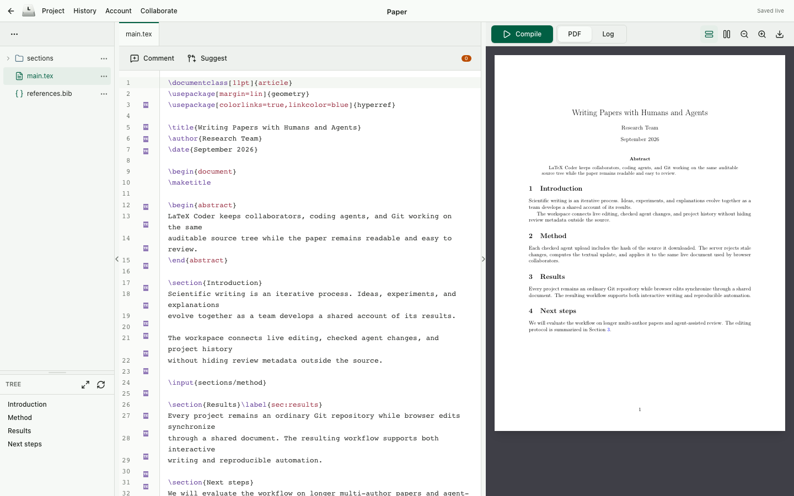

<p align="center">
  
</p>

<h1 align="center">LaTeX Coder</h1>

<p align="center"><strong>A self-hosted LaTeX workspace where people, coding agents, and Git work on the same paper.</strong></p>

<p align="center">
  <a href="https://railway.com/deploy/latexcoder?referralCode=4KUZ4o&amp;utm_medium=integration&amp;utm_source=template&amp;utm_campaign=generic"></a>
</p>

LaTeX Coder combines real-time collaborative editing, a built-in PDF and Log
workflow, project Git repositories, and agent-safe editing APIs. The source tree
remains ordinary files on disk. Yjs keeps browser sessions synchronized, SQLite
stores application state, and every project is a real Git repository on `main`.



> Working with BibTeX? See [Biblock](https://github.com/EvoEvolver/biblock), an
> auditable bibliography workflow for humans and agents.

## Why LaTeX Coder

### Write together

- Edit simultaneously with live cursors and presence.
- Share a project with a View or Edit capability link. Guests do not need an
  account; signed-in recipients confirm before joining persistently as viewers
  or collaborators.
- Comment, reply, and suggest changes inline. Review data is encoded as LaTeX
  macros, so an agent can read and edit it instead of interacting with an
  opaque UI-only review layer.
- Inspect character-level authorship in Blame mode, including the first Git
  checkpoint containing each range.

### Navigate the paper, not just its files

- Browse an indented file tree with folders, drag-and-drop moves, downloads,
  recoverable deletion, image/PDF previews, and open-file tabs.
- Use **Tree** for the section outline and **TreeWriter** for a paper-level view
  of section titles, `\tldr`, and `\sectiontldr` summaries. Leaf source can be
  edited in place with the same CodeMirror interactions as the main editor.
- Command-click on macOS, or Ctrl-click elsewhere, to follow `\cite`, `\citep`,
  `\citet`, `\ref`, `\autoref`, `\cref`, `\include`, `\includegraphics`, and
  `\url` targets. Citation completion includes titles and authors.
- Search the entire project, optionally with sandboxed ripgrep-compatible
  regular expressions, and preview multi-file replacements before applying them.

### Compile and debug without leaving the editor

- Compile with Tectonic or an explicitly configured latexmk installation.
- Switch between **PDF** and **Log** beside the editor. Log groups errors and
  warnings, surfaces the first fatal error, and links diagnostics back to their
  source file and line.
- Navigate both ways with SyncTeX: source to PDF and PDF to centered source.
- Fit the PDF to page width or a whole page, zoom it, download it, or switch
  between Source and PDF on smaller screens.
- Keep the last successful preview while editing; the UI marks it only when it
  becomes stale.

### Give agents a first-class editing path

Every collaborator can copy a project-specific **Agent editing** command from
the Collaborate menu. It opens a plain-text manual containing the project's
files and capability-bearing API URLs.

The default edit workflow is deliberately simple:

1. Download a complete UTF-8 file and retain its `X-Content-SHA256` header.
2. Edit it with ordinary local tools.
3. Upload the complete replacement with that hash as `X-Base-SHA256`.

The server calculates and applies the Yjs changes in one transaction. If a
collaborator changed the file in the meantime, the upload is rejected with
HTTP 409 rather than overwriting newer work. Agent access can apply changes
directly or force every edit into reviewable suggestions. The same manual also
documents project search, PDF and Log diagnostics, blame, reviews, and Git. It
tells agents to use Git only when the user explicitly asks for it.

## LaTeX Coder vs. Overleaf

LaTeX Coder is not intended to match Overleaf's hosting scale, template
ecosystem, publisher integrations, or support organization. It takes a
different approach for trusted teams that want to own their infrastructure and
make coding agents part of the writing workflow.

| | LaTeX Coder | Overleaf |
| --- | --- | --- |
| Hosting | Self-hosted Node service; persistent data stays on your volume. | Hosted service, with separate on-premises products. |
| Guest collaboration | View/Edit capability links; an account is optional for project access. | Account-based collaboration with plan-dependent collaborator limits. |
| Review data | Comments, replies, and suggestions are LaTeX macros visible to humans, agents, and Git. | Comments and Track Changes are platform-managed; Track Changes is a premium feature. |
| Git model | Every project is a Git repository. Yjs represents `main`; incoming changes are merged before import. | Git Bridge translates Overleaf history into one linear branch named `master`; cloud Git integration is premium. |
| Git and reviews | Macro-backed review state travels with source and is validated on import. | Overleaf advises against mixing active Git use with comments or Track Changes because pushes can displace or lose review metadata. |
| Agent editing | Project-scoped plain-text manual, checked full-file edits, search, build/Log diagnostics, blame, review, and Git APIs. | General editor and integration workflows rather than this checked file-edit protocol. |
| Export | ZIP of the live working tree, including uncommitted source changes. | Source ZIP; the compiled PDF and most generated files are downloaded separately. |

Comparison details are based on Overleaf's official documentation for
[plans][overleaf-plans], [Track Changes][overleaf-track-changes],
[advanced Git behavior][overleaf-git], and [project downloads][overleaf-download].

[overleaf-plans]: https://docs.overleaf.com/getting-started/free-and-premium-plans/premium-features
[overleaf-track-changes]: https://docs.overleaf.com/collaborating/track-changes
[overleaf-git]: https://docs.overleaf.com/integrations-and-add-ons/git-integration-and-github-synchronization/git-integration/advanced-git-operations
[overleaf-download]: https://docs.overleaf.com/managing-projects-and-files/downloading-a-project

## Quick Start

Requirements: Node.js 22+, pnpm 10+, and Git.

```sh
pnpm install
pnpm check
LATEXCODER_ADMIN_PASSWORD='use-a-long-random-password' pnpm start
```

Open <http://127.0.0.1:8090>. On an empty data directory, sign in as `admin`
with `LATEXCODER_ADMIN_PASSWORD`. The password must contain at least 10
characters and is used only to create the first account. Existing users can
then issue registration links that expire after seven days. Links are
single-use by default and can optionally remain reusable until they expire.

For local development:

```sh
LATEXCODER_ADMIN_PASSWORD='1234567890' pnpm dev
```

Vite serves the client at <http://127.0.0.1:5173> and proxies application,
WebSocket, share, and Git traffic to the TypeScript server on port 8090.

## Projects and access

Only registered users have a project dashboard and can create projects. A
project may have multiple registered collaborators; each collaborator sees it
in their own dashboard and receives distinct Browser, Agent, and Git secrets.
Projects support shared tags, title/tag search, tag filters, and per-user
archiving. Project URLs use short generated IDs and do not change when a project
is renamed.

The bootstrap administrator has a paginated administration panel for all users
and projects. It supports account search, password resets with session
revocation, soft user deletion that preserves projects and attribution, and
project deletion. Regular members cannot access the panel or its APIs.

Guests enter through `/share/<project-id>/<secret>`. The secret is exchanged for
a 24-hour, project-scoped HttpOnly session before redirecting to the clean
project URL. Signed-in users see a confirmation page before adding a project or
upgrading View access to Edit access. Rotating a collaborator's secret
invalidates that person's old Browser, Agent, and Git links without affecting
other members.

New projects can be created from ZIP archives. ZIP upload inside an existing
project adds files without overwriting existing paths. Imports reject path
traversal, Git metadata, and oversized archives.

## Git and live collaboration

Every project starts on `main`, and the collaborative Yjs documents always
represent that branch. Browser edits are checkpointed after 30 seconds of
inactivity, or at most every five minutes during continuous editing. Unchanged
content does not create an empty commit.

Clone, fetch, and pull first checkpoint the latest collaborative content, so a
browser user does not need to push before a local Git client can see their work.
A personal remote is available from **Collaborate → Git access**:

```sh
git clone https://your-host/git/<project-id>/<personal-secret>
cd <project-id>
# edit and commit normally
git push origin main
```

On push, LaTeX Coder checkpoints current Yjs state, merges the incoming commit
in a temporary worktree, validates the result, and imports a clean merge into
the live documents. If it cannot merge safely, the incoming work is retained on
`conflict/<UTC timestamp>` while `main` and Yjs remain unchanged.

The History view provides paginated checkpoints, per-file diffs, an Agent edits
filter, and whole-project or single-file restore. A restore creates a new commit
instead of rewriting history.

## Compilation and Log

Project settings select the main TeX file, compiler, and optional automatic
compilation. In `auto` mode the server uses `LATEXCODER_LATEX_BIN`, Tectonic, or
latexmk. If neither compiler is present, it installs a local verified Tectonic
binary on first use. Selecting latexmk explicitly requires latexmk to be
installed already.

The Log view separates parsed diagnostics from the full compiler output. Errors
and warnings are grouped into scannable items; source-aware items jump directly
to the relevant file and line. The first fatal error is promoted so it can be
found without searching the raw transcript.

PDF navigation requires the `synctex` executable. The Docker image includes it.
Compile an older project once after deployment to generate its synchronization
data.

The Agent PDF endpoint always represents current source. It compiles when
needed and reuses the cached artifact otherwise. A failed current build returns
HTTP 422 JSON with the compiler log, structured diagnostics, and the first fatal
error; it never silently gives an agent a stale PDF as evidence of success.

## Docker and Railway

The image includes Tectonic, SyncTeX, Git, ripgrep, and bubblewrap. It stores all
persistent state beneath `/data` but deliberately declares no Docker `VOLUME`.

```sh
docker build -t latexcoder .
docker volume create latexcoder-data
docker run --rm \
  --name latexcoder \
  --publish 8090:8090 \
  --security-opt seccomp=unconfined \
  --env LATEXCODER_ADMIN_PASSWORD='use-a-long-random-password' \
  --volume latexcoder-data:/data \
  latexcoder
```

The seccomp override permits bubblewrap to create the namespaces used by regex
search. It is unnecessary when sandboxed ripgrep search is not used.

For Railway, use the deploy button above, attach a persistent volume at `/data`,
and set `LATEXCODER_ADMIN_PASSWORD`. Railway's injected `PORT` is accepted
automatically; no custom start command is required.

## Configuration

| Variable | Default | Purpose |
| --- | --- | --- |
| `LATEXCODER_ADMIN_PASSWORD` | none | Creates the initial `admin` account on an empty database. |
| `LATEXCODER_STATE_DIR` | `.latexcoder` | SQLite database, projects, Git repositories, Yjs snapshots, build cache, and PDFs. |
| `LATEXCODER_HOST` | `0.0.0.0` | Listener address. |
| `LATEXCODER_PORT` | `PORT` or `8090` | Listener port. |
| `LATEXCODER_LATEX_BIN` | auto-detected | Explicit Tectonic or latexmk executable. |
| `LATEXCODER_COMPILE_CONCURRENCY` | `2` | Process-wide concurrent build limit. |
| `LATEXCODER_RG_BIN` | `rg` | ripgrep executable used by regex search. |
| `LATEXCODER_BWRAP_BIN` | `bwrap` | bubblewrap executable used to sandbox ripgrep. |
| `LATEXCODER_SYNCTEX_BIN` | `synctex` | SyncTeX executable used for source/PDF navigation. |

`GET /health/live` is the liveness probe. `GET /health/ready` reports the
SQLite schema version, compile queue, and detected external tools. Missing
optional tools are reported without making the editor itself unready.

## Data model

```text
<state-dir>/
  state.sqlite
  projects/<project-id>/
    project/        source files and the project's .git directory
    build/          current compilation artifacts
```

SQLite is authoritative for users, invitations, sessions, membership, sharing,
project settings, build state, trash, and Yjs snapshots. Source files and each
project's Git repository remain directly accessible on disk.

The codebase is TypeScript throughout:

- `src/client` contains the React/Vite interface and browser controllers.
- `src/server` contains HTTP routes, Git/Yjs coordination, persistence,
  compilation, and bounded external processes.
- `src/shared` contains schemas, parsers, review macros, diagnostics, and source
  mapping used across environments.

Run the complete validation suite with:

```sh
pnpm check
pnpm test
```

## Security model

LaTeX Coder is designed for trusted teams, not hostile multi-tenant workloads.
Passwords are scrypt-hashed; invitations and capability URLs use high-entropy
tokens; sessions and access records persist in SQLite. Anyone holding an Edit,
Agent, or Git capability can modify that project within the capability's scope.

Regex search runs through ripgrep in a read-only bubblewrap sandbox with no
network, a 15-second timeout, and a 4 MiB output limit. Literal search also
works on macOS without bubblewrap. LaTeX compilation itself is **not** a
security sandbox. Do not compile untrusted projects or store unrelated secrets
inside project directories.

## License

[MIT](LICENSE)
